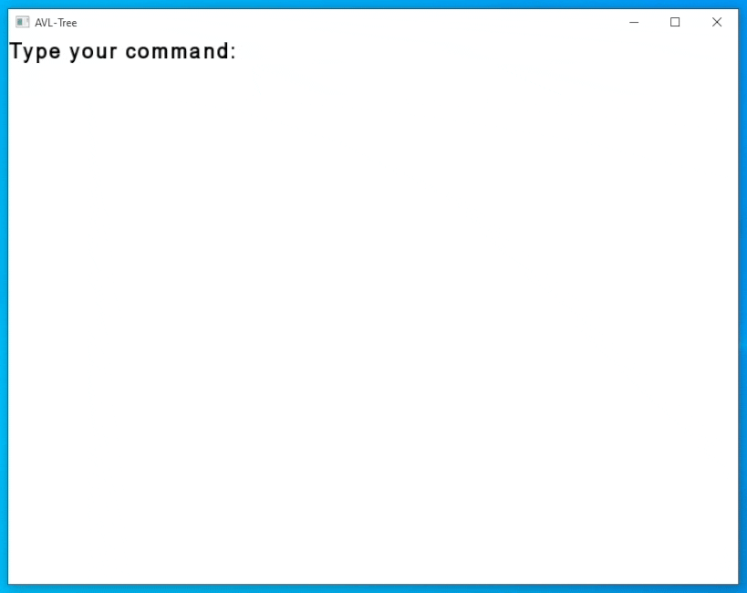

# kursach2022


## How to build [for Windows]
1. ```git clone``` the repository
2. Run  ```git submodule init``` and ```git submodule update``` to download the SFML Library (it will take some time and may seem stuck, but be patient)
3. Build the SFML library accroding to this tutorial: https://www.sfml-dev.org/tutorials/2.5/compile-with-cmake.php
4. Run "build.bat"
5. Run /res/AVLTree.exe

## How to use
- Type "ADD #", where # is a number, to add a node to the tree
- Type "DEL #", where # is a number, to remove a node from the tree

## What's new?
Controller <-> Viewer connection now uses Observer Pattern, removed unnecessary methods from the AVL-Tree class, changed the data type used by Model <-> Viewer Observer connection, Application now has AVL-Tree, Viewer and Controller as variables, added onSubscribe methods, etc.
